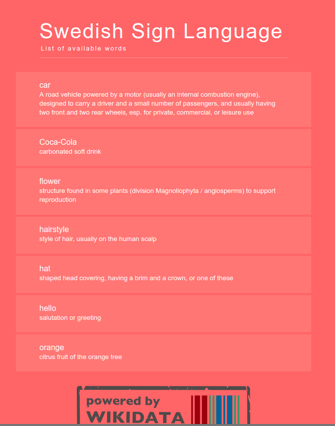
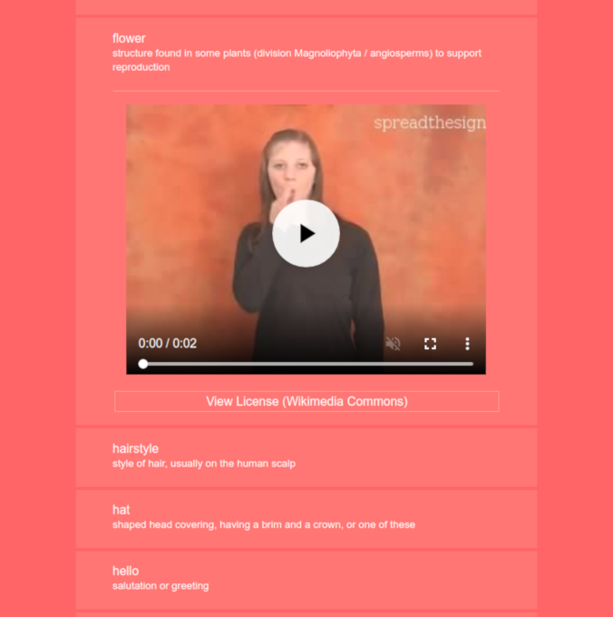

# Sign Language Browser

A web application for browsing and learning sign languages, powered by Wikidata.

## Setup

Once you installed NodeJS and npm, that you can get from [NodeJS download page](https://nodejs.org/en/download/), run the following commands from the command prompt:

```bash
git clone https://github.com/Abbe98/wikidata-sign-language-browser.git
cd wikidata-sign-language-browser
npm install
npm run serve
```
## Usage

Once you have run the above commands, open the [http://localhost:8080/sign-language-browser/](http://localhost:8080/sign-language-browser/) page.

You will see the following UI:


It lists the languages that have at least one item (can be thought as a term) stored in the [www.wikidata.org](https://www.wikidata.org/) site with a link to a sign language video. When you click the language, you will get a list of the items with the linked sign language videos:



When you click an item you can watch the video:



## A word for developers

The application is implemented using [Vue.js](https://vuejs.org/) and for querying the Wikidata it uses the [query.wikidata.org](https://query.wikidata.org/) service. You can [take a look at a query](https://query.wikidata.org/#SELECT%20%28COUNT%28%3Flang%29%20as%20%3Fcount%29%20%3FlangLabel%20%28REPLACE%28STR%28%3Flang%29%2C%20%22http%3A%2F%2Fwww.wikidata.org%2Fentity%2F%22%2C%20%22%22%29%20as%20%3FlangQ%29%0AWHERE%20%20%7B%0A%20%20%3Fitem%20wdt%3AP2919%20%3Ffile%20.%0A%20%20%3Fitem%20p%3AP2919%20%3Fstatement%20.%0A%20%20%3Fstatement%20pq%3AP407%20%3Flang%20.%0A%20%20SERVICE%20wikibase%3Alabel%20%7B%20bd%3AserviceParam%20wikibase%3Alanguage%20%22%5BAUTO_LANGUAGE%5D%2Cen%22%20.%20%7D%0A%7D%0AGROUP%20BY%20%3FlangLabel%20%3Flang%0AORDER%20BY%20DESC%28%3Fcount%29) that is used by the application. The query language is [SPARQL](https://www.google.fi/search?q=sparql).
