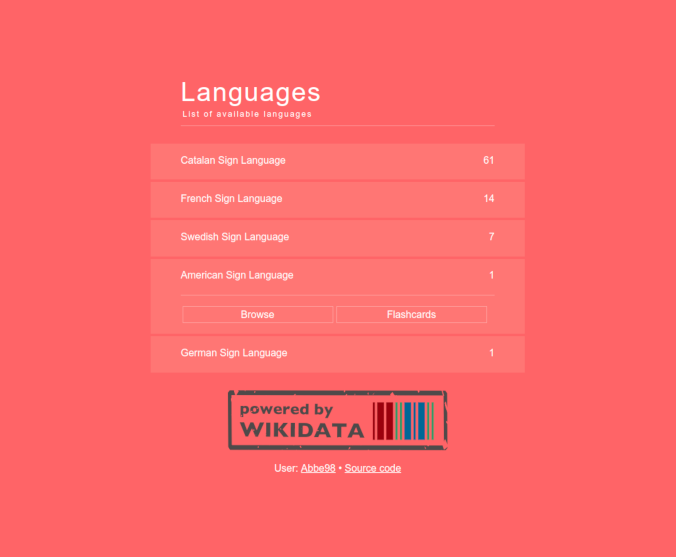

# Sign Language Browser

A web application for browsing and learning sign languages, powered by Wikidata.

## Setup

Once you installed NodeJS and npm, that you can get from <a href="https://nodejs.org/en/download/" target="_blank">NodeJS download page</a>, run the following commands from the command prompt:

```bash
git clone https://github.com/Abbe98/wikidata-sign-language-browser.git
cd wikidata-sign-language-browser
npm install
npm run serve
```
## Usage

Once you have run the above commands, open the <a href="http://localhost:8080/sign-language-browser/" target="_blank">http://localhost:8080/sign-language-browser/</a> page.

You will see the following UI:



It lists the languages that have at least one item (can be thought as a term) stored in the <a href="https://www.wikidata.org/" target="_blank">www.wikidata.org</a> site with a link to a sign language video. When you click the language, you will get a list of the items with the linked sign language videos:


When you click an item you can watch the video:


## A word for developers

The application is implemented using <a href="https://vuejs.org/" target="_blank">Vue.js</a> and for querying the Wikidata it uses the <a href="https://query.wikidata.org/" target="_blank">query.wikidata.org</a> service. You can <a href="https://query.wikidata.org/#SELECT%20%28COUNT%28%3Flang%29%20as%20%3Fcount%29%20%3FlangLabel%20%28REPLACE%28STR%28%3Flang%29%2C%20%22http%3A%2F%2Fwww.wikidata.org%2Fentity%2F%22%2C%20%22%22%29%20as%20%3FlangQ%29%0AWHERE%20%20%7B%0A%20%20%3Fitem%20wdt%3AP2919%20%3Ffile%20.%0A%20%20%3Fitem%20p%3AP2919%20%3Fstatement%20.%0A%20%20%3Fstatement%20pq%3AP407%20%3Flang%20.%0A%20%20SERVICE%20wikibase%3Alabel%20%7B%20bd%3AserviceParam%20wikibase%3Alanguage%20%22%5BAUTO_LANGUAGE%5D%2Cen%22%20.%20%7D%0A%7D%0AGROUP%20BY%20%3FlangLabel%20%3Flang%0AORDER%20BY%20DESC%28%3Fcount%29" target="_blank">take a look at a query</a> that is used by the application. The query language is <a href="https://www.google.fi/search?q=sparql" target="_blank">SPARQL.
